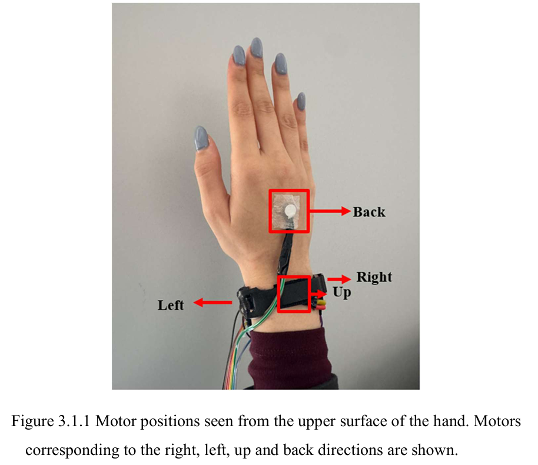
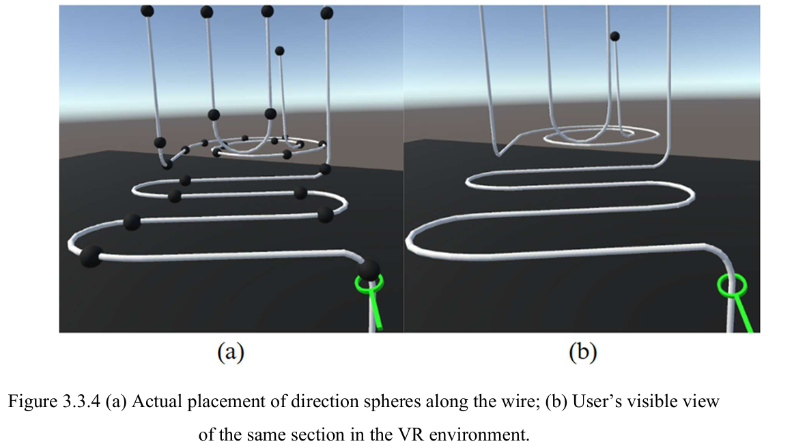
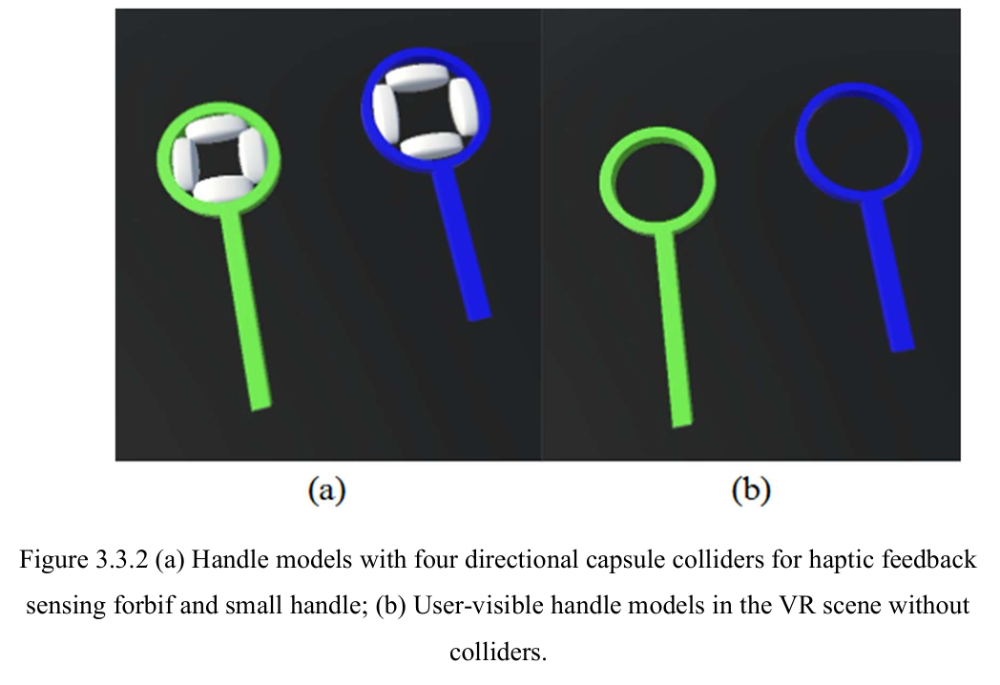

# Bringing Tactile Feedback to Virtual Reality: 3-Axis Bluetooth Haptic Bracelet

## About The Project
Virtual Reality (VR) environments often lack physical feedback, which limits depth perception and spatial awareness. This project presents the design, development, and evaluation of a wireless, Bluetooth-enabled haptic feedback bracelet designed to enhance user interaction and navigation in VR.

The system was tested using a custom VR adaptation of the classic "wire-and-hoop" game, requiring precise 3D spatial navigation and hand-eye coordination. 

### Key Features:
**6-Directional Haptic Feedback:** Utilizes 6 ERM vibration motors placed on the X, Y, and Z axes of the wrist/hand to provide intuitive directional cues (Left, Right, Up, Down, Forward, Back).

**Wireless Integration:** Real-time data transmission between the Unity VR environment and the Arduino microcontroller via an HC-05 Bluetooth module running at 115200 baud rate.

**Context-Sensitive Collision Detection:** Employs precise capsule colliders in Unity to provide early haptic warnings *before* a physical collision occurs, guiding the user's trajectory.

## Built With

* **Software:** Unity 3D (2020.3.21f1 LTS), C#, Blender (3D Modeling)
* **Hardware:** Oculus Quest 2, Arduino Mega 2560, HC-05 Bluetooth Module, 6x ERM Vibration Motors

## Hardware Setup & VR Scene

The haptic bracelet is designed for mobility. The Arduino Mega and a 10,000 mAh power bank are housed in a wearable armband. Motor activations are dynamically mapped to the user's hand rotation in Unity, ensuring the vibration direction always corresponds accurately to the user's real-world wrist orientation.

### Haptic Trigger Mechanism (Capsule Colliders)

To provide early and precise directional warnings, the haptic feedback is not triggered by the visible mesh of the handle. Instead, four invisible **capsule colliders** (Top, Bottom, Left, Right) are strategically embedded inside the inner ring of the hoop. 

When the user gets dangerously close to the wire, the corresponding capsule collider makes contact first. This instantly sends a directional signal to the Arduino via Bluetooth, triggering a specific motor on the wrist. This mechanism allows the user to feel the proximity and dynamically correct their hand trajectory *before* making an actual error (hitting the main handle body).

## Experimental Results

We conducted a user study with 18 participants completing a total of 324 trials under various feedback conditions and difficulty levels.

* **Performance Boost:** "Partial Haptic" feedback (moderate intensity, close-range proximity warnings) significantly reduced collision errors compared to both "No Haptic" and "Full Haptic" conditions.
* **Cognitive Load:** The addition of directional haptic feedback improved accuracy without increasing task completion time or mental fatigue, proving the system's efficiency as a sensory guide.
* **User Preference:** 67% of participants preferred the partial haptic condition, noting it was stimulating enough to guide them without being distracting.

